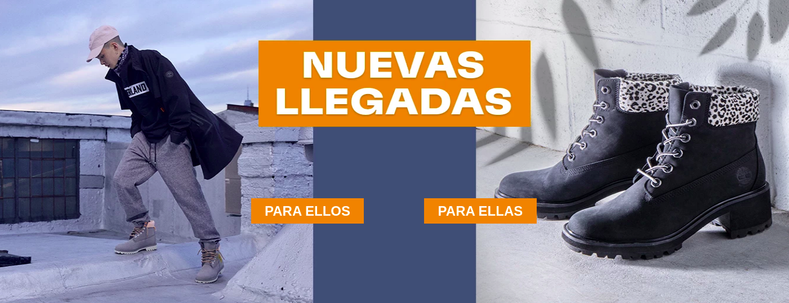

# custom infocard

custom infocar that renders using render-runtime.



## Configuration

Declare the block in the theme of your store with the following accessories (infocard with buttons)

```
"custom-infocard-button#banner-home-button-2": {
    "props": {
      "width": "100%",
      "maxHeight": "540px",
      "src": "assets/home/Banner_2riob_NuevasLlegadas _2.jpg",
      "listButton": [
        {
          "title": "PARA ELLOS",
          "href": "/new-arrivals-hombre",
          "blockClass": "para-ellos"
        },
        {
          "title": "PARA ELLAS",
          "href": "/new-arrivals-mujer",
          "blockClass": "para-ellas"
        }, 
        {...}
      ]
    }
  }
  
```
Description props
```
"custom-infocard-button#banner-home-button-2": {
    "props": {
      "width": " width infocard ",
      "maxHeight": "maxHeight infocard",
      "src": "src image",
      "listButton": [ (List of buttons that are needed in the infocard)
        {
          "title": "Title button",
          "href": "href to which you will redirect the button",
          "blockClass": "blockClass to customize the button"
        }
      ]
    }
  }
```
Declare the block in the theme of your store with the following accessories 

```
 "custom-infocard#banner-home-1": {
    "props": {
      "width": "100%",
      "maxHeight": "540px",
      "src": "assets/home/Banner_2rio_Hikers.jpg",
      "link": "/disfruta-el-camino"
    }
  },

  
```
Description props
```
 "custom-infocard#banner-home-1": {
    "props": {
      "width": "widht infocard",
      "maxHeight": "maxHeight infocard",
      "src": "src image",
      "link": "link to which you will redirect"
    }
  },

```

## Customization

In order to apply CSS customizations in this and other blocks, follow the instructions given in the recipe on [Using CSS Handles for store customization](https://vtex.io/docs/recipes/style/using-css-handles-for-store-customization).

| CSS Handles            |
| ---------------------- |
| `CustomInfocardContainer` |
| `CustomInfocard`    |
| `CustomInfocardButtonContainer` |
| `CustomInfocardButton`    |
| `ButtonInfocard` |

## Contributors ✨

- Mario Rodriguez
