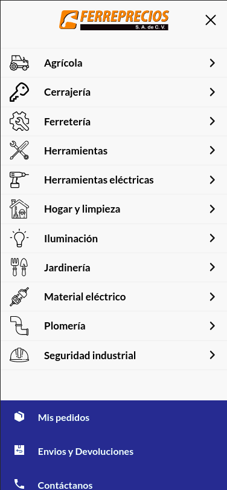
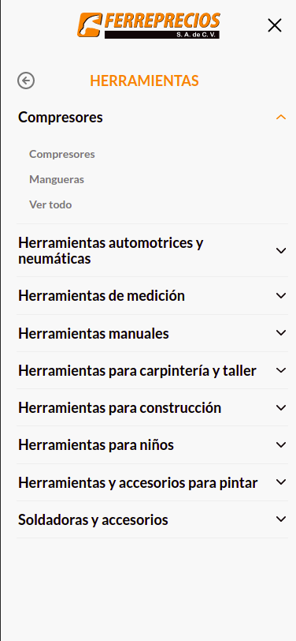
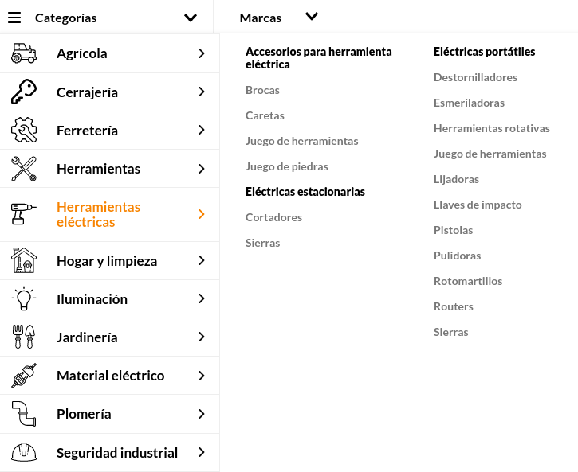
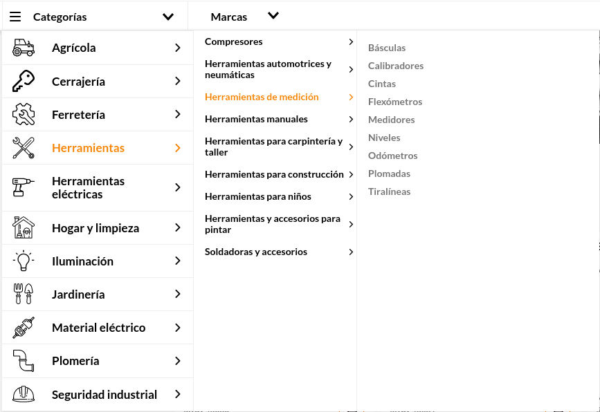

📢 Use this project, [contribute](https://github.com/vtex-apps/drawer) to it or open issues to help evolve it using [Store Discussion](https://github.com/vtex-apps/store-discussion).

# Custom Mobile Menu
To use into the store theme, This component allows you to create a page with options that when selected will send you to a menu with submenus accordions that correspond to the selected option. It can also receive components of vtex as children




## Configuration

Add the app to your theme's dependencies on the `manifest.json`, for example:

```json
"dependencies": {
  "ferrepreciosmx.custom-mobile-menu": "0.x"
}
```

Declare the custom-mobile-menu block and send the props and children.
```json
"custom-mobile-menu": {
    "props": {
      "menu": [
        //MENU Agricola
        {
          "id": 1,
          "active": true,
          "title": "Agrícola",
          "href": "/agricola",
          "items": [
            //Submenus de herramientas---------------------------------------------------
            {
              //Submenu Riego
              "id": 1,
              "active": true,
              "title": "Riego",
              "href": "/agricola/riego",
              "items": [
                {
                  "title": "Motobombas",
                  "href": "/agricola/riego/motobombas?map=tipo-de-producto"
                }
              ]
            }
          ]
        },
        //MENU Cerrajeria
        {
          "id": 2,
          "active": false,
          "title": "Cerrajería",
          "href": "/cerrajeria",

          "items": [
            {
              //Submenus de Seguridad---------------------------------------------------

              "id": 1,
              "active": true,
              "title": "Seguridad",
              "href": "/cerrajeria/seguridad",
              "items": [
                {
                  "title": "Candados",
                  "href": "/cerrajeria/seguridad/candados?map=tipo-de-producto"
                },
                {
                  "title": "Cerraduras",
                  "href": "/cerrajeria/seguridad/cerraduras?map=tipo-de-producto"
                },
                {
                  "title": "Cerrojos",
                  "href": "/cerrajeria/seguridad/cerrojos?map=tipo-de-producto"
                }
              ]
            }
          ]
        },
        //MENU Ferretería
        {
          "id": 3,
          "active": false,
          "title": "Ferretería",
          "href": "/ferreteria",
          "items": [
            //Submenu Acopladores y bolas de arrastre
            {
              "id": 1,
              "active": true,
              "title": "Acopladores y bolas de arrastre",
              "href": "/ferreteria/acopladores-y-bola-de-arrastre",
              "items": [
                {
                  "title": "Amarres y arrastres",
                  "href": "/ferreteria/acopladores-y-bola-de-arrastre/amarres-y-arrastres?map=tipo-de-producto"
                }
              ]
            },
            //Submenu Herramientas de carga
            {
              "id": 2,
              "active": false,
              "title": "Herramientas de carga",
              "href": "/ferreteria/herramientas-de-carga",
              "items": [
                {
                  "title": "Malacates",
                  "href": "/ferreteria/herramientas-de-carga/malacates?map=tipo-de-producto"
                }
              ]
            },
            //Submenu Lonas y toldos
            {
              "id": 3,
              "active": false,
              "title": "Lonas y toldos",
              "href": "/ferreteria/lonas-y-toldos",
              "items": [
                {
                  "title": "Lonas",
                  "href": "/ferreteria/lonas-y-toldos/lonas?map=tipo-de-producto"
                }
              ]
            },
            //Submenu Organización y almacenamiento
            {
              "id": 4,
              "active": false,
              "title": "Organización y almacenamiento",
              "href": "/ferreteria/organizacion-y-almacenamiento",
              "items": [
                {
                  "title": "Cajas",
                  "href": "/ferreteria/organizacion-y-almacenamiento/cajas?map=tipo-de-producto"
                },
                {
                  "title": "Cintas",
                  "href": "/ferreteria/organizacion-y-almacenamiento/cintas?map=tipo-de-producto"
                },
                {
                  "title": "Estantes",
                  "href": "/ferreteria/organizacion-y-almacenamiento/estantes?map=tipo-de-producto"
                },
                {
                  "title": "Organizadores",
                  "href": "/ferreteria/organizacion-y-almacenamiento/organizadores?map=tipo-de-producto"
                },
                {
                  "title": "Portaherramientas",
                  "href": "/ferreteria/organizacion-y-almacenamiento/portaherramientas?map=tipo-de-producto"
                }
              ]
            },
            //Submenu Seguridad
            {
              "id": 5,
              "active": false,
              "title": "Seguridad",
              "href": "/ferreteria/seguridad",
              "items": [
                {
                  "title": "Seguridad en bardas",
                  "href": "/ferreteria/seguridad/seguridad-en-bardas?map=tipo-de-producto"
                }
              ]
            }
          ]
        }
        
      ]
    },
    "children": [
      //Hijos que se le mandan al app custom
      "flex-layout.row#mobile-drawer-row-contact"
    ]
  },
```

3. Declare the app block in your store inside your porduct display page.

```json
{
   ...
   "children":[
      "custom-mobile-menu"
   ]
}
```

## Customization

In the store-theme create a file theme-name.custom-mobile-menu.css inside the css folder and you can change css properties through the defined useCssHandles classes.


# Store Drawer Custom

<!-- ALL-CONTRIBUTORS-BADGE:START - Do not remove or modify this section -->

[](#contributors-)

<!-- ALL-CONTRIBUTORS-BADGE:END -->

This component allows you to have a sliding drawer for your menus. This is specially handy for mobile layouts.

## Configuration

Add the app to your theme's dependencies on the `manifest.json`, for example:

```json
"dependencies": {
  "ferrepreciosmx.horizontal-hover-menu": "0.x"
}
```

Then, you need to add the `drawer` block into your app. The following is an example taken from [Store Theme](https://github.com/vtex-apps/store-theme).

```json
"ferrepreciosmx.horizontal-hover-menu:drawer": {
  "children": [
    "menu#drawer"
  ]
},

"menu#drawer": {
  "children": [
    "menu-item#category-clothing",
    "menu-item#category-decoration",
    "menu-item#custom-sale"
  ],
  "props": {
    "orientation": "vertical"
  }
},
```

There is also a block that can be used for customizing the icon that triggers the opening of the drawer, it's called `"drawer-trigger"` and can be used as follows:

```json
"ferrepreciosmx.horizontal-hover-menu:drawer": {
  "children": [
    "menu#drawer"
  ],
  "blocks": ["drawer-trigger"]
},

"ferrepreciosmx.horizontal-hover-menu:drawer-trigger": {
  "children": ["rich-text#open-drawer"]
},

"rich-text#open-drawer": {
  "text": "Open drawer"
}

"menu#drawer": {
  "children": [
    "menu-item#category-clothing",
    "menu-item#category-decoration",
    "menu-item#custom-sale"
  ],
  "props": {
    "orientation": "vertical"
  }
},
```

And there is a block that enables customization of the header that contains the button which closes the drawer.
It's called `"drawer-header"` and can be used in a similar way as `"drawer-trigger"`, here is an example:

```jsonc
// inside blocks.json
{
  "ferrepreciosmx.horizontal-hover-menu:drawer": {
    "blocks": ["drawer-header#my-drawer"]
  },
  "ferrepreciosmx.horizontal-hover-menu:drawer-header#my-drawer": {
    "children": [
      // you need to include the block `drawer-close-button` somewhere inside here
      "flex-layout.row#something",
      // ...
      "drawer-close-button"
    ]
  }
}
```


## Configuration

The `drawer` block accepts a few props that allow you to customize it.

| Prop name            | Type                                                                       | Description                                                                           | Default value  |
| -------------------- | -------------------------------------------------------------------------- | ------------------------------------------------------------------------------------- | -------------- |
| `maxWidth`           | `number` or `string`                                                       | Define the open Drawer's maximum width.                                               | `450`          |
| `isFullWidth`        | `Boolean`                                                                  | Control whether or not the open Drawer should occupy the full available width.        | `false`        |
| `slideDirection`     | `'horizontal'`&#124;`'vertical'`&#124;`'rightToLeft'`&#124;`'leftToRight'` | Controls the opening animation's direction.                                           | `'horizontal'` |
| `backdropMode`       | `'default'`&#124;`'none'`                                                  | Controls if it should display the backdrop when the Drawer is open                    |
| `customPixelEventId` | `string`   | Store event ID responsible for triggering the `drawer` to automatically open itself on the interface. | `undefined`    |
| `customPixelEventName` | `string`                                                                   | Store event name responsible for triggering the `drawer` to automatically open itself on the interface. Some examples are: `'addToCart'` and `'removeFromCart'` events. Notice that using this prop will make the drawer open in **every** event with the specified name if no `customPixelEventId` is specified. | `undefined`    |

The `drawer-close-button` block accepts the following props to customize it:

| Prop name | Type                     | Description                                   | Default value |
| --------- | ------------------------ | --------------------------------------------- | ------------- |
| `size`    | `Number`                 | Define the size of the icon inside the button | `30`          |
| `type`    | `'filled'`&#124;`'line'` | Define the type of the icon                   | `'line'`      |

The `drawer-trigger` block accepts the following prop to customize it:

| Prop name            | Type     | Description                                                           | Default value |
| -------------------- | -------- | --------------------------------------------------------------------- | ------------- |
| `customPixelEventId` | `string` | Defines the event ID to be sent whenever users interact with the Drawer component. | `undefined`   |

## Customization

In order to apply CSS customizations in this and other blocks, follow the instructions given in the recipe on [Using CSS Handles for store customization](https://vtex.io/docs/recipes/style/using-css-handles-for-store-customization).

| CSS Handles              |
| ------------------------ |
| `drawer`                 |
| `opened`                 |
| `overlay`                |
| `overlay--visible`       |
| `closed`                 |
| `moving`                 |
| `drawerContent`          |
| `drawerHeader`           |
| `drawerTriggerContainer` |
| `openIconContainer`      |
| `closeIconContainer`     |
| `closeIconButton`        |
| `childrenContainer`      |


# Custom Desktop Menu
To use into the store theme, This component allows you to create a menu with options that when selected will show you to the right to a menu with submenus that correspond to the selected option. if you wish to show the menu in 3 layers use the prop "dropRigthMenus" and indicate in the array the menus to show in 3 layers.




## Configuration

Add the app to your theme's dependencies on the `manifest.json`, for example:

```json
"dependencies": {
  "ferrepreciosmx.horizontal-hover-menu": "0.x"
}
```

Declare the custom-desktop-menu block and send the props and children.
```json
"custom-desktop-menu": {
    "props": {
      "menu": [
        //MENU Agricola
        {
          "id": 1,
          "active": true,
          "title": "Agrícola",
          "href": "/agricola",
          "items": [
            //Submenus de herramientas---------------------------------------------------
            {
              //Submenu Riego
              "id": 1,
              "active": true,
              "title": "Riego",
              "href": "/agricola/riego",
              "items": [
                {
                  "title": "Motobombas",
                  "href": "/agricola/riego/motobombas?map=tipo-de-producto"
                }
              ]
            }
          ]
        },
        //MENU Cerrajeria
        {
          "id": 2,
          "active": false,
          "title": "Cerrajería",
          "href": "/cerrajeria",

          "items": [
            {
              //Submenus de Seguridad---------------------------------------------------

              "id": 1,
              "active": true,
              "title": "Seguridad",
              "href": "/cerrajeria/seguridad",
              "items": [
                {
                  "title": "Candados",
                  "href": "/cerrajeria/seguridad/candados?map=tipo-de-producto"
                },
                {
                  "title": "Cerraduras",
                  "href": "/cerrajeria/seguridad/cerraduras?map=tipo-de-producto"
                },
                {
                  "title": "Cerrojos",
                  "href": "/cerrajeria/seguridad/cerrojos?map=tipo-de-producto"
                }
              ]
            }
          ]
        },
        //MENU Ferretería
        {
          "id": 3,
          "active": false,
          "title": "Ferretería",
          "href": "/ferreteria",
          "items": [
            //Submenu Acopladores y bolas de arrastre
            {
              "id": 1,
              "active": true,
              "title": "Acopladores y bolas de arrastre",
              "href": "/ferreteria/acopladores-y-bola-de-arrastre",
              "items": [
                {
                  "title": "Amarres y arrastres",
                  "href": "/ferreteria/acopladores-y-bola-de-arrastre/amarres-y-arrastres?map=tipo-de-producto"
                }
              ]
            },
            //Submenu Herramientas de carga
            {
              "id": 2,
              "active": false,
              "title": "Herramientas de carga",
              "href": "/ferreteria/herramientas-de-carga",
              "items": [
                {
                  "title": "Malacates",
                  "href": "/ferreteria/herramientas-de-carga/malacates?map=tipo-de-producto"
                }
              ]
            },
            //Submenu Lonas y toldos
            {
              "id": 3,
              "active": false,
              "title": "Lonas y toldos",
              "href": "/ferreteria/lonas-y-toldos",
              "items": [
                {
                  "title": "Lonas",
                  "href": "/ferreteria/lonas-y-toldos/lonas?map=tipo-de-producto"
                }
              ]
            },
            //Submenu Organización y almacenamiento
            {
              "id": 4,
              "active": false,
              "title": "Organización y almacenamiento",
              "href": "/ferreteria/organizacion-y-almacenamiento",
              "items": [
                {
                  "title": "Cajas",
                  "href": "/ferreteria/organizacion-y-almacenamiento/cajas?map=tipo-de-producto"
                },
                {
                  "title": "Cintas",
                  "href": "/ferreteria/organizacion-y-almacenamiento/cintas?map=tipo-de-producto"
                },
                {
                  "title": "Estantes",
                  "href": "/ferreteria/organizacion-y-almacenamiento/estantes?map=tipo-de-producto"
                },
                {
                  "title": "Organizadores",
                  "href": "/ferreteria/organizacion-y-almacenamiento/organizadores?map=tipo-de-producto"
                },
                {
                  "title": "Portaherramientas",
                  "href": "/ferreteria/organizacion-y-almacenamiento/portaherramientas?map=tipo-de-producto"
                }
              ]
            },
            //Submenu Seguridad
            {
              "id": 5,
              "active": false,
              "title": "Seguridad",
              "href": "/ferreteria/seguridad",
              "items": [
                {
                  "title": "Seguridad en bardas",
                  "href": "/ferreteria/seguridad/seguridad-en-bardas?map=tipo-de-producto"
                }
              ]
            }
          ]
        }
        
      ],
      "dropRigthMenus": ["Herramientas"]
    },
    "children": [
      //Hijos que se le mandan al app custom
      "flex-layout.row#mobile-drawer-row-contact"
    ]
  },
```

3. Declare the app block in your store inside your porduct display page.

```json
{
   ...
   "children":[
      "custom-desktop-menu"
   ]
}
```

## Customization

In the store-theme create a file theme-name.custom-desktop-menu.css inside the css folder and you can change css properties through the defined useCssHandles classes.


## Contributors ✨

Thanks goes to these wonderful people ([emoji key](https://allcontributors.org/docs/en/emoji-key)):

<!-- ALL-CONTRIBUTORS-LIST:START - Do not remove or modify this section -->
<!-- prettier-ignore-start -->
<!-- markdownlint-disable -->
<table>
  <tr>
    <td align="center"><a href="https://github.com/Radu1749"><br /><sub><b>Radu1749</b></sub></a><br /><a href="https://github.com/vtex-apps/drawer/commits?author=Radu1749" title="Code">💻</a></td>
    <td align="center"><a href="https://github.com/rayra-alencar"><br /><sub><b>rayra-alencar</b></sub></a><br /><a href="https://github.com/vtex-apps/drawer/commits?author=rayra-alencar" title="Code">💻</a></td>
    <td align="center"><a href="https://gitlab.com/fbailon"><br /><sub><b>Fernando Bailon</b></sub></a><br />💻</td>
  </tr>
</table>

<!-- markdownlint-enable -->
<!-- prettier-ignore-end -->

<!-- ALL-CONTRIBUTORS-LIST:END -->

Thanks goes to these wonderful people ([emoji key](https://allcontributors.org/docs/en/emoji-key)):

This project follows the [all-contributors](https://github.com/all-contributors/all-contributors) specification. Contributions of any kind are welcome!
