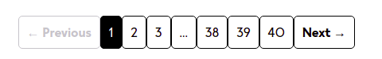

# Product Summary Slider

<!-- DOCS-IGNORE:start -->
<!-- ALL-CONTRIBUTORS-BADGE:START - Do not remove or modify this section -->

[](#contributors-)

<!-- ALL-CONTRIBUTORS-BADGE:END -->
<!-- DOCS-IGNORE:end -->

This custom app shows a row of pagination buttons with numbers controls.



## Configuration

1. Add the app as a dependency in your store theme

```
"store-theme.pagination:"0.x"
```

2. Declare the app block in your store inside the plp page

```
  "pagination-number": {
    "props": { 
      "nextLabel": "Siguiente", 
      "previousLabel": "Anterior",
      "nextLabelMobile": "Sig", 
      "previousLabelMobile": "Ant" 
      }
  }

```

3. Add the block inside the search result.
```
{
   ...
   "children":[
      "pagination-number"
   ]
}
```

Props description:

- "nextLabel": It is the text of the next button, if you dont set this prop, it takes by default "Next →" 
- "previousLabel": It is the text of the previous button, if you dont set this prop, it takes by default "← Previous",
- "nextLabelMobile": It is the text of the next button in mobile, if you dont set this prop, it takes by default "→", 
- "previousLabelMobile": It is the text of the previous button in mobile, if you dont set this prop, it takes by default "←" 
- "srcLoadingImage": It is the source of the image to show while the page charge, if you dont set this prop, it takes by default the spinner component from vtex.

## Important
To use this interface is necessary to remove the "fetch-more" and the "fetch-previous" button of the search result block.


## Customization

In the custom app already exist a file in the css folder whith ".tsx" extension, in that file add your styles to customize the component.


## Contributors ✨

Thanks goes to these wonderful people:
- Mario Rodriguez
- Luis Fernando Bailon