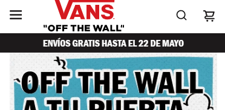
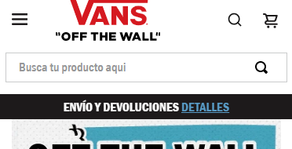

# Trigger Layout

This custom app allow change the class from active to inactive of a block by clicking in a trigger component.

/* demo image with trigger-layout inactive * /




/* demo image with trigger-layout active */




## Configuration

1. Adding the "trigger-layout" custom app to the vans-store-theme dependecies.
In the theme's  manifest.json,   add the "trigger-layout" custom  app as a dependency:

```
"dependencies": {
   "vansmx.trigger-layout": "0.x",
}
```

Now you are able to use all the blocks exported by the trigger-layout app. Check out
the full list below:
|Block Name|Description|
|-----------|----------|
|trigger| This app doesn't render by itself, but render the children which when they are pressed send the event to activate or deactivate the layout |
|trigger-layout| This app doesn't render by itself, but render the children on it wrapped by a div element that change the classes to active or inactive |
|trigger-intersection| This component trigger an event when the children are in the viewport, changing the class in the trigger layout from active to inactive|

2. Adding the Trigger Layout to page templates.
You have to define the Trigger Layout as shown below. This example show a trigger#search-trigger that has a menu item as child element and when is clicked will change the style class of the trigger-layout#search-mobile from active to inactive and viceversa.

```
{
	"trigger#search-trigger":  {
		"children":  [""] //contains the search icon
	},

	"trigger-layout#search-mobile":  {
		"children":  [""] //contains the search
	}
}
```

Customization
Thereafter, you should add a single column table with the available CSS handles for the app, like the one below. Note that the Handles must be ordered alphabetically.
| CSS Handles |
| ----------- |
|  layoutContainer  |
|  layoutContainer--active  |
|  layoutContainer--inactive  |

Then you can customize the css styles, for example to show or hide the search bar you have to write the code in the file vansmx.trigger-layout.css:

```
.layoutContainer--mobile {
	transition: height 0.3s;
	overflow: hidden;
	background-color: #fff;
}

.layoutContainer--mobile--active {
	height: 65px;
}

.layoutContainer--mobile--inactive {
	height: 0;
}
```

You can also define a blockClass in the trigger-layout to customize an specific element , in that case the handler will be like:
| CSS Handles with blockClass |
| ----------- |
|  layoutContainer--blockClass--active  |
|  layoutContainer--blockClass--inactive  |
